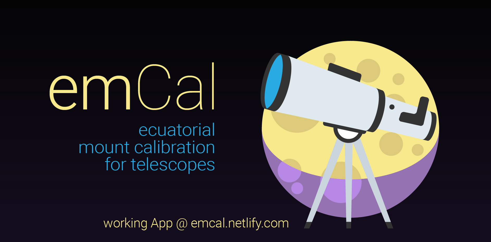
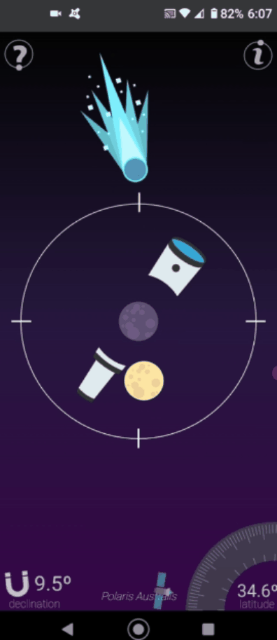

# **emCal**

## **e**cuatorial **m**ount **cal**ibration for telescopes

### working demo can be found [here](https://emcal.netlify.com)

emCal is a progressive web app that uses the World Magnetic Model from the National Oceanic and Atmospheric Administration to calculate the magnetic declination at the Latitude and Altitude the App is being used.  
Using the magnetic declination it is possible to create a compass that points to the celestial pole instead of the geographical pole.  
This App detects in wich hemisphere is used and automatically adapts to it, but it is specially useful in the southern hemisphere as there is no polar star bright enough to calibrate telescopes by eye.  
As a plus, the emCal App also has a spirit/bubble level to help leveling the tripod's legs.  

